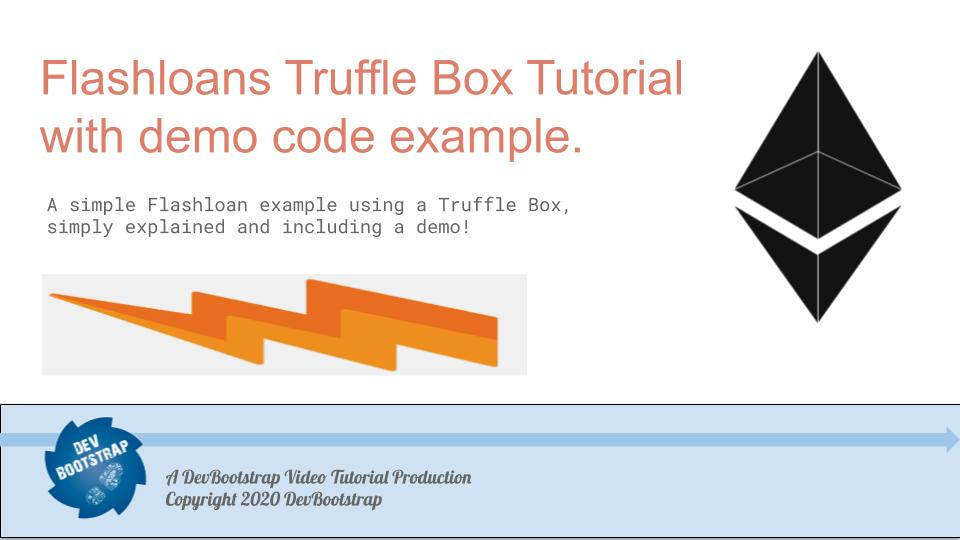

Aave have kindly put together a Tuffle Box that really helps for developing smart contracts that use [flashloans](https://docs.aave.com/developers/tutorials/performing-a-flash-loan/...-with-truffle).

I am working on some flashloan projects and thought to take a look at the Truffle box they made.

The Truffle Box is really easy to use and the main challenges are really around understanding how to properly fund your Smart Contracts wiht the ERC-20 tokens that you need to pay the fees.

I've put together an example in our [DevBootstrap GitHub repo here](https://github.com/devbootstrap/flashloan-truffle-box-example) and there is also a full screencast that I made on the [DevBootstrap YouTube channel here](https://www.youtube.com/watch?v=aYSGeVkCWXU).

Please take a look and let me know what you think in the commets on YouTube and don't forget to subscribe and like the video!

Thank you for your support.